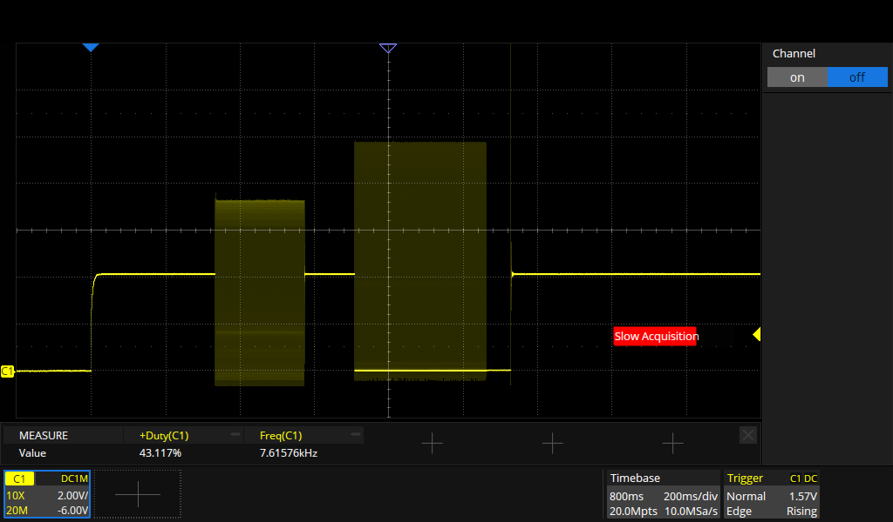
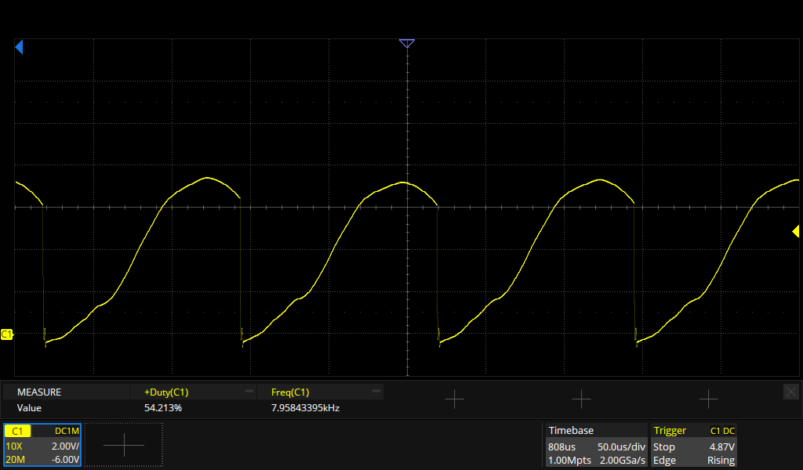
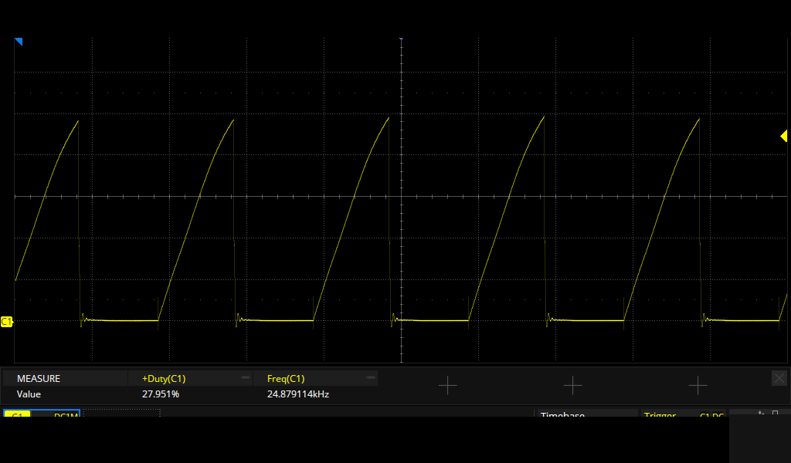

# Specification
## Power Supply
* ICR18650-1300FY, protected Li-Ion cell : 1300mAh, 100㏀ thermistor.  Unfortunately it's not a 10㏀ thermistor, which would have been a more standard value for connection to a battery charger.
* Solar panel : 5.5V open circuit, 10mA short circuit
* LDO : 2.5V output, which is used as VCC for MCU and PIR-sensors

## LED
JST-PH clone connector :
1. Cathode red LED (probably has a resistor)
2. Cathode White LEDs
3. Anode red LED
4. Anode White LEDs

There are 6 white LEDs in parallel, they are bright enough at 50mA.  The forward voltage is around 3.3V then.

## Piezo

At power up: 240ms, 8kHz waveform, followed by 355ms of 24.8kHz

8kHz waveform = 7.91Vpp

24.8kHz waveform = 9.9Vpp

## PIR sensor
At startup, the PIR-sensor data shows some pulses.  Later on, it continuously outputs a 62% duty cycle square wave at 2.5V.  I have no idea how this ASchip D210AX works.  It seems to use a serial one-wire protocol to transfer its ADC-value.  The [datasheet](./doc/ASChip_D210AX.pdf) doesn't provide any info about the protocol.