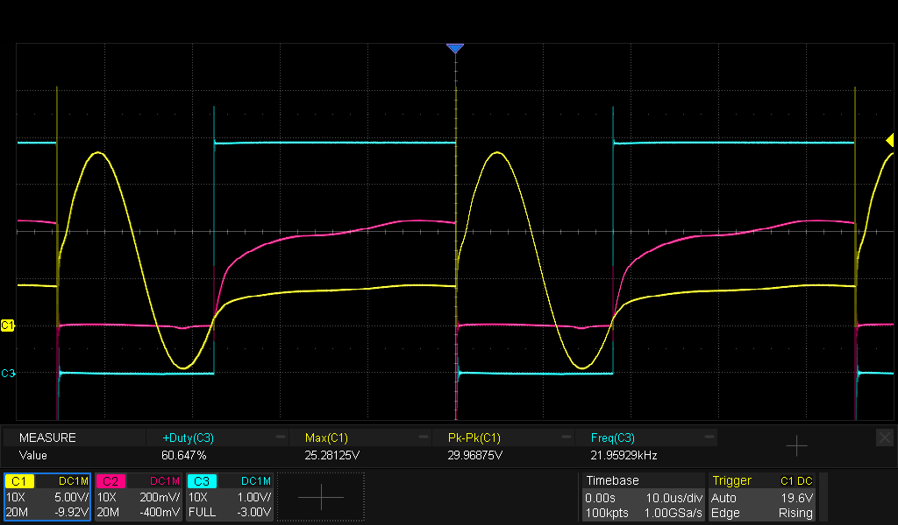
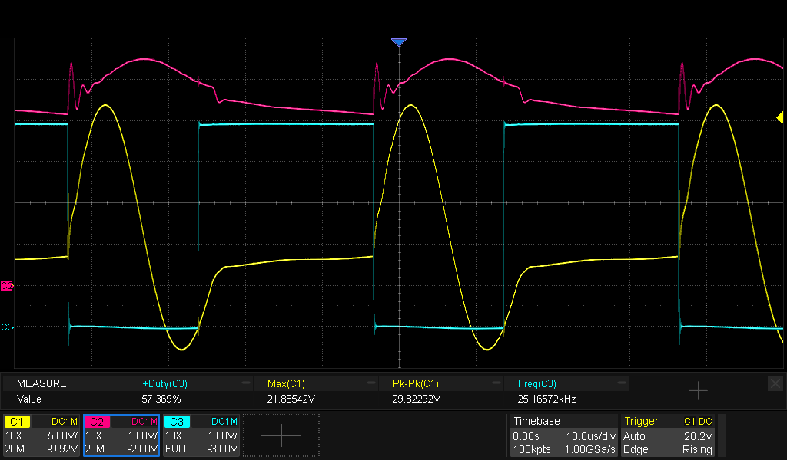

# Acoustic Resonance (?)
1. Connect the piezo element directly to the output of the signal generator.
2. Set the signal generator to sine wave mode, no DC-offset.
3. Connect an oscilloscope to the signal generator output
3. Sweep the frequency range from 1kHz to 100kHz.
4. Watch the oscilloscope for a dip in the sine wave.

For the piezo elements of the Delta-Sport cat repeller, that frequency is 22kHz.

Is this the acoustic resonance?  When doing the same test with another piezo element, the frequency where the dip occurs was the loudest.

# Capacitance of the piezo elements
The capacitance of the Delta-Sport elements is around 115nF

# Parallel inductor
We need an inductor to form an parallel LC-resonant circuit at double the acoustic frequency.

$$
L = \frac{1}{(2*\pi*f)^2*C} = \frac{1}{(2*\pi*44k)^2*115n} = 114µH
$$

By trial and error, I tried several inductors to find the one that yielded the highest voltage across the piezo element.  The inductor that worked best was between 120µH and 150µH.

# Breadboard LC-resonant circuit
The circuit according to [EDN](https://www.edn.com/increase-piezoelectric-transducer-acoustic-output-with-a-simple-circuit/).  BS170 NMOS-transistor with 1ohm from Source to Ground.  The inductor consists of a series of two 56µH inductors. 

* Yellow trace : voltage at the anode of the 1N4148 diode
* Pink trace : voltage on the source of the BS170 NMOS-transistor
* Blue trace : voltage on the gate of the BS170 NMOS-transistor

To avoid current peaks, the duty cycle of the square wave should be between 60% and 70%.

* Yellow trace : voltage at the anode of the 1N4148 diode
* Pink trace : voltage over a 1ohm resistor connected between +5V and the top of the inductor.
* Blue trace : voltage on the gate of the BS170 NMOS-transistor

There's about 1.5A peak to peak current through the inductor.

# Alternative circuit
Another method is to build a boost converter and then drive the piezo element with a square wave.  